# 永和區獨居長者訪查管理平台 — 系統成果簡報

> **閱讀對象**：新北市社會局／區公所長官與業務承辦  
> **落地單位**：永和區公所 · 115 年度擴大獨居老人服務訪查  
> **正式網站**：https://elder-visit-platform-ruby.vercel.app  
> **簡報日期**：2026 年 10 月  
> **對應 HTML**：同目錄 [`README.html`](./README.html)（圖片已內嵌，可單檔寄出／開啟給長官瀏覽）  
> **簡報副本**：[`docs/briefings/社會局系統成果簡報.html`](./docs/briefings/社會局系統成果簡報.html)

---

## 一、為什麼要做這套系統

傳統獨老訪查常見痛點：

| 痛點 | 系統解法 |
|------|----------|
| 名冊分散在多份 Excel，難查重、難追蹤 | **名冊匯入＋檢核＋正式寫入**，案號去重 |
| 訪查結果手工抄錄，欄位易錯 | 手機／平板登打關懷表，規則即時提醒 |
| 上報衛福部要對 100 多欄，耗時易退件 | **稽核通過後一鍵匯出 102 欄 xlsx** |
| 訪員身分難辨識，長者與家屬不安心 | **永和官方證件套樣式訪員證＋簽到 QR** |
| 承辦要跨多表對進度 | 工作台顯示「待派案→待補件→待稽核→待核銷」 |

**核心效益一句話**：把「清冊進來 → 派案訪查 → 稽核把關 → 成果匯出／核銷」串成同一條可追蹤的數位流程，減少重工與退件。

---

## 二、目前成果進度（已上線）

| 面向 | 完成狀態 | 說明 |
|------|----------|------|
| 正式站部署 | ✅ | Vercel Production 已上線 |
| 營運資料主檔 | ✅ | Google 試算表（承辦可直接查閱） |
| 業務 API | ✅ | Google Apps Script Web App |
| 名冊匯入 | ✅ | CSV 預覽、欄位對應、範例檔、確認寫入 |
| 派案／訪查登打 | ✅ | 任務、關懷表、空訪（未遇需照片／定位） |
| 稽核佇列 | ✅ | 通過後才能進入匯出／核銷 |
| 衛福部 102 欄匯出 | ✅ | GAS 產生 xlsx，可存 Google Drive |
| 訪員證（證件套） | ✅ | 官方永和證件套正面／背面＋翻面守則；**手機自動縮小整張證件不超出畫面** |
| 志工出勤 | ✅ | 外勤掃 QR、公所刷證、月結 Excel |
| 車馬費核銷批次 | ✅ | 稽核通過後彙整（訪視費＋資料處理費） |

試運行參考數據（畫面擷取當下，會隨作業變動）：

- 個案名冊約 **56** 筆已進系統  
- 承辦工作台可見待派案、待補件、待稽核、待核銷等進度卡  
- 匯出頁可篩選「只顯示稽核通過」後批次匯出

### 示範／測試帳號（給社會局同仁演練）

> 以下為**試運行示範帳號**，僅供介紹與操作演練，非正式個人帳號。演練後請登出；請勿外流至公開社群。

| 用途 | 入口網址 | Email／識別 | 密碼／說明 | 建議體驗 |
|------|----------|-------------|------------|----------|
| **訪查員／志工（建議）** | [/visitor/login](https://elder-visit-platform-ruby.vercel.app/visitor/login) | `visitor@eldervisit.org` | `visitor123` | 訪員證、任務、關懷表、時數／核銷 |
| **訪查員（Joe，含證件照）** | 同上 | `joe@elder.org` | `joejoe123456` | 官方證件套樣式訪員證、到宅簽到 |
| **承辦管理者（示範）** | [/login](https://elder-visit-platform-ruby.vercel.app/login) | `manager@eldervisit.org` | `manager123` | 工作台、名冊、派案、匯出 |
| **督導（示範）** | [/login](https://elder-visit-platform-ruby.vercel.app/login) | `supervisor@eldervisit.org` | `supervisor123` | 稽核通過／退回 |
| **稽核（示範）** | [/login](https://elder-visit-platform-ruby.vercel.app/login) | `auditor@eldervisit.org` | `auditor123` | 稽核佇列檢視 |
| **唯讀檢視（示範）** | [/login](https://elder-visit-platform-ruby.vercel.app/login) | `viewer@eldervisit.org` | `viewer123` | 總覽唯讀 |

**志工出勤（免 Email，身分證演練）**

| 代號 | 姓名 | 身分證（測試號） | 組別 | 入口 |
|------|------|------------------|------|------|
| T-MEAL | 測試送餐甲 | `A123456789` | 送餐服務組 | [/volunteer/clock](https://elder-visit-platform-ruby.vercel.app/volunteer/clock)（外勤掃 QR） |
| T-OFF | 測試內勤乙 | `B234567894` | 行政內勤組 | [/office/kiosk](https://elder-visit-platform-ruby.vercel.app/office/kiosk)（公所刷證，需先承辦登入） |

> 正式承辦日常作業另可用公所 Google 帳號登入後台；上表示範帳號不需 Google。

---

## 三、系統架構（長官版）

本系統採「**介面／邏輯／資料**」三層分工，另以 GitHub 控管規格與版本。下圖採**左右泳道**：由左至右看日常資料流，下方為規格版本層；箭線不穿越文字。

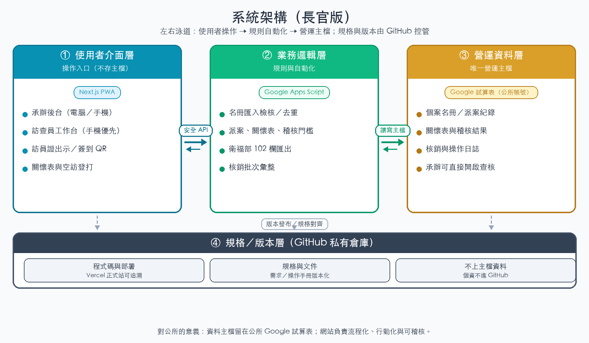

### 架構怎麼讀

1. **使用者介面層**  
   承辦與訪查員用手機或電腦開啟同一套網站（PWA）。這是每日操作入口，不存放營運主檔。

2. **業務邏輯層（GAS）**  
   負責匯入檢核、派案、關懷表、稽核門檻、衛福部 102 欄匯出等「規則與自動化」。避免把複雜邏輯散落在 Excel 公式中。

3. **營運資料層（Google 試算表）**  
   名冊、派案、關懷表、稽核、核銷與日誌都寫在**公所 Google 帳號**的試算表。承辦可直接開啟查核。

4. **規格／版本層（GitHub）**  
   程式、文件與部署流程私有控管，確保上線版本可追溯。

**對公所的意義**：資料主檔仍在公所可控的 Google 試算表；網站負責把流程「流程化、行動化、可稽核」，而不是另建一套看不見的黑箱資料庫。

---

## 四、端到端服務流程（總覽）

訪查主流程與志工出勤並行流程如下。重點是：**稽核通過**才進入匯出與核銷，避免未完成案件直接上報或請款。

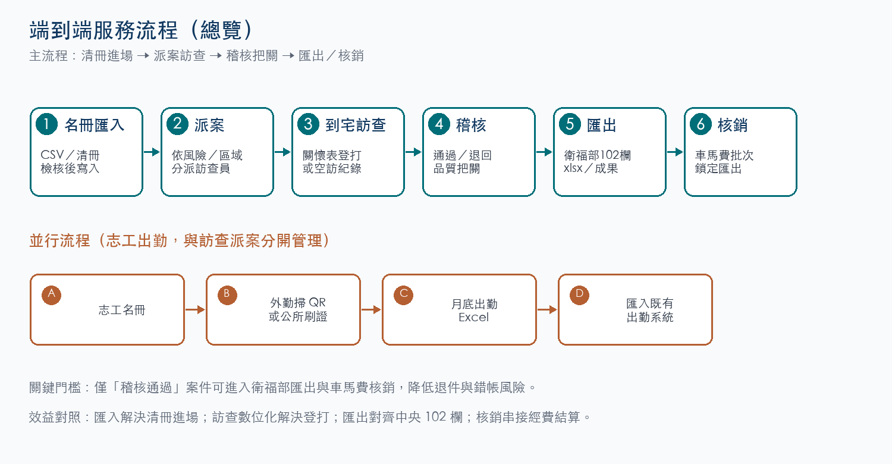

### 主流程六步（訪查服務）

1. **名冊匯入**：清冊以 CSV 進場，系統先檢核再寫入。  
2. **派案**：依風險、區域與量能分派訪查員。  
3. **到宅訪查**：手機登打關懷表；未遇則走空訪（需照片／定位）。  
4. **稽核**：承辦／督導通過或退回補件。  
5. **匯出**：產出衛福部／社會局中央系統 102 欄 xlsx 與成果報表。  
6. **核銷**：彙整車馬費批次並鎖定後匯出。

### 並行流程（志工出勤）

與訪查派案分開管理：志工名冊 → 外勤掃 QR 或公所刷證 → 月底出勤 Excel → 匯入既有出勤系統。

---

## 五、系統效益：匯入與匯出（重點）

匯入與匯出是長官最常關心的「進得來、出得去」。先看價值鏈，再看操作截圖（截圖縮小，文字說明放大）。

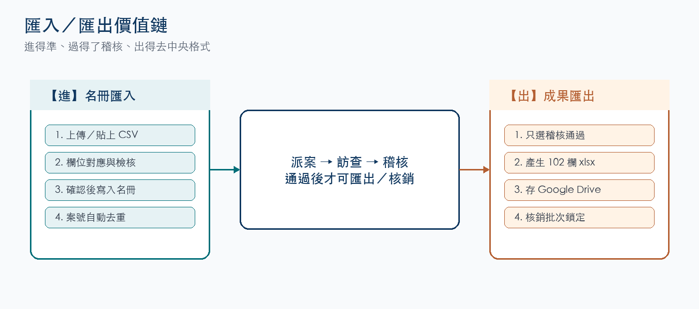

### 5.1 匯入：清冊進得來、進得準

**效益重點**

- **批次進場**：CSV／TXT 上傳或貼上，不必一筆筆手打。  
- **先預覽再寫入**：顯示總筆數、可匯入、需修正，避免髒資料入庫。  
- **欄位自動對應**：支援測試編號／案號、姓名、訪視地址、行政區等常見欄名。  
- **內建範例**：一鍵下載／載入 `DEMO-YH-*`，降低教育訓練成本。  
- **案號去重**：相同個案編碼略過，不重複新增。

**必填欄位**：測試編號（或案號）、姓名、訪視地址、訪視行政區  
**建議欄位**：個案類型、年齡、戶籍里、電話、派案優先級

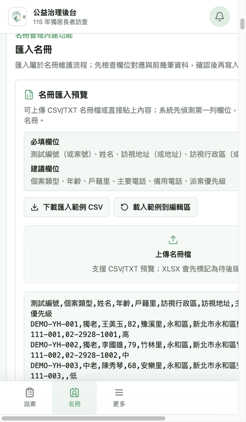

### 5.2 匯出：成果出得去、符合中央格式

**效益重點**

- **稽核門檻**：預設只顯示稽核通過，未過關不進中央檔。  
- **102 欄對齊**：依衛福部／社會局中央系統格式產生 xlsx。  
- **雲端交付**：可存 Google Drive，方便承辦上傳中央系統。  
- **多模板**：訪查成果 CSV、中央 Excel、核銷報表 XLSX 等。  
- **同意治理**：匯出用途受同意書範圍提醒，降低個資風險。

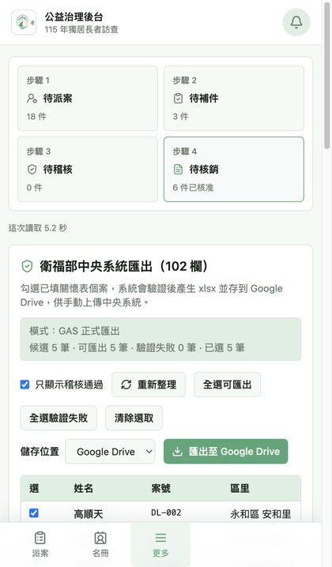

---

## 六、不同使用者視角的工作流程

### 6.1 承辦管理者（區公所）

**目標**：高風險先派、缺件先追、通過後匯出／核銷。

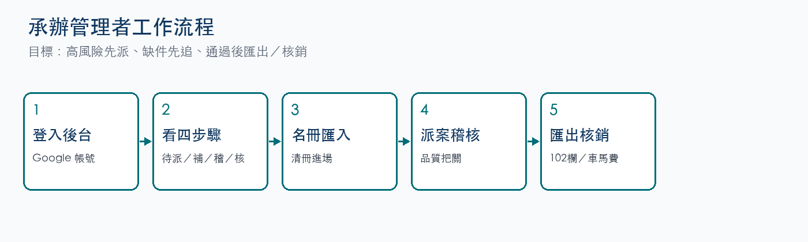

**文字解說**

1. 以公所 Google 帳號登入後台。  
2. 先看工作台「待派案／待補件／待稽核／待核銷」四步驟。  
3. 需要時執行名冊匯入或查詢。  
4. 完成派案，並對送件案件稽核。  
5. 通過後匯出 102 欄，並建立核銷批次。

**操作畫面（縮小示意）**

<div style="display:flex;flex-wrap:wrap;gap:12px;align-items:flex-start;margin:12px 0 20px;">
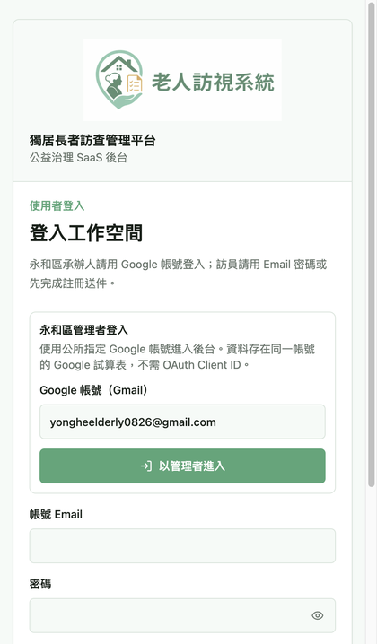
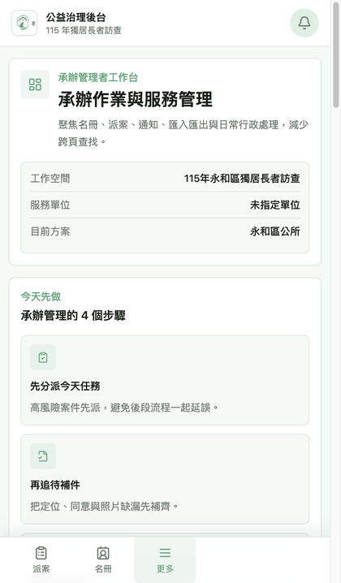
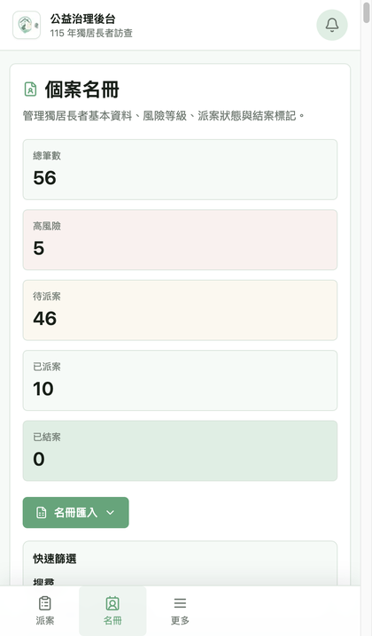
</div>

### 6.2 訪查員（第一線）

**目標**：出示證件、完成任務、依通知補正。

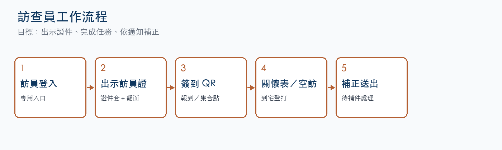

**文字解說**

1. 使用訪員專用入口登入（與管理者入口分開）。  
2. 首頁出示永和證件套樣式訪員證，可點擊翻面看守則。  
3. 下方 QR 供報到櫃檯掃描；也可掃描集合點 QR。  
4. 進入任務：到宅先**拍攝門牌／門口＋定位簽到**，再完成關懷表或空訪。  
5. 多件派案逐案處理；全部送出後可出現「已完成今日任務」，**手動確認**後簽退出勤。  
6. 於「時數」查看簽到退與車馬費試算；於「核銷」查看訪視費／稽核狀態。  
7. 若被退回，依通知補正後再送。

**手機顯示原則（規格）**

- 單張證件含**完整黑框**，整張依螢幕自動縮小。  
- 證件照疊在灰框內側，不蓋過框線。  
- 姓名字級對齊官方 PDF：**24pt**（約證卡寬度 8–9%）。  
- 到宅簽到與未遇佐證分開：門牌照用於簽到；未遇才另需佐證照片。

**操作畫面（縮小示意）**

<div style="display:flex;flex-wrap:wrap;gap:12px;align-items:flex-start;margin:12px 0 20px;">
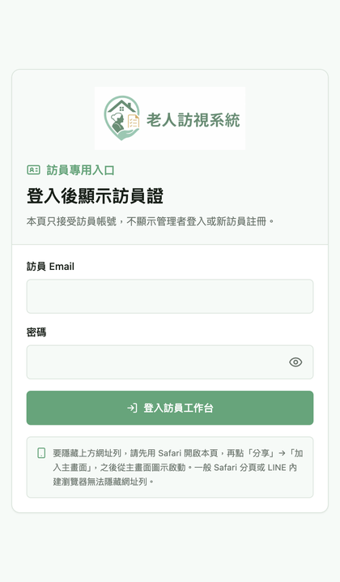

</div>

訪員證正／背面裁切比例相同（781×1076），示意圖以同尺寸並排顯示。

- 訪員登入：https://elder-visit-platform-ruby.vercel.app/visitor/login
- 測試帳號：`visitor@eldervisit.org`／`visitor123`
- 含證件照示範：`joe@elder.org`／`joejoe123456`（詳見上文「示範／測試帳號」）

### 6.3 督導／稽核

**目標**：把關品質，決定可否匯出與核銷。

1. 查看稽核佇列。  
2. 通過或退回補件。  
3. 通過案件進入匯出候選與核銷批次。

### 6.4 社會局長官（檢視成果）

**建議 10 分鐘檢視路徑**

1. 開啟正式站登入頁，確認角色分流清楚。  
2. 進入承辦工作台，看四步驟進度。  
3. 開啟名冊匯入，確認清冊可批次進場。  
4. 開啟匯出，確認 102 欄與稽核門檻。  
5. 了解訪員端有官方證件套與任務登打能力。

---

## 七、已完成功能架構總表

| 模組 | 主要能力 | 主要入口 |
|------|----------|----------|
| 身分與權限 | 承辦 Google 登入、訪員 Email、角色分流 | `/login`、`/visitor/login` |
| 名冊 | 查詢、風險篩選、狀態、**匯入** | `/manager/cases` |
| 派案 | 依區域／風險／量能分派 | `/manager/assignments` |
| 訪查 | 門牌簽到、關懷表、空訪、草稿、任務 | `/visitor/tasks`、`/visitor/visits/...` |
| 時數／車馬費 | 簽到退明細、累積時數、季結試算 | `/visitor/hours` |
| 訪員證 | 證件套樣式、手機自動縮放、翻面守則、簽到 QR | `/visitor/home` |
| 稽核 | 通過／退回 | `/manager/audit` |
| 匯出 | 102 欄 xlsx、成果／核銷模板 | `/manager/exports` |
| 核銷 | 訪視費＋資料處理費批次 | `/manager/exports`、核銷相關頁 |
| 高關懷 | 橘／黃／綠列管 | `/manager/high-care` |
| 志工出勤 | QR／刷證、月結 Excel | `/manager/attendance`、`/volunteer/clock` |
| 通報 | 公告、跑馬燈 | `/manager/notifications` |

### 7.1 可填寫／可匯出報表一覽（已完成）

以下為目前**已上線、可實際操作**的填寫與匯出項目（長官／承辦對照用）。「部分」代表有入口但檔案格式或完整度尚在補強。

#### A. 可填寫（登打／送出）

| 名稱 | 角色 | 入口 | 說明 |
|------|------|------|------|
| 衛福部生活關懷表 | 訪查員 | `/visitor/visits/...` | 手機登打；草稿可離線暫存 |
| 空訪（未遇） | 訪查員 | 同上 | 未遇須照片＋定位 |
| 到宅門牌簽到退 | 訪查員 | 訪視頁簽到區 | 門牌／門口照＋GPS，綁單案 |
| 電子同意書（個資／社政保密／民政保密） | 訪查員 | `/visitor/consents` | 手機手寫簽名 |
| 訪員註冊申請 | 準訪員 | `/register` | 含證件照 |
| 訪員資料補完（含銀行／存摺） | 訪查員 | `/visitor/profile` | 匯款資料待承辦審核 |
| 志工／訪員出勤打卡 | 訪查員／志工 | `/volunteer/clock`、訪員證 QR | 集合點掃碼或公所刷證 |
| 稽核核准／退回 | 督導／承辦 | `/manager/audit` | 通過後才可匯出／核銷 |
| 名冊 CSV 匯入 | 承辦 | `/manager/import` | 預覽後正式寫入 |
| 高關懷列管狀態 | 承辦 | `/manager/high-care` | 橘／黃／綠追蹤 |

#### B. 可匯出／下載（檔案或列印）

| 名稱 | 角色 | 入口 | 格式 | 狀態 |
|------|------|------|------|------|
| 衛福部／中央 102 欄關懷表 | 承辦 | `/manager/exports` | **xlsx**（可存 Drive） | ✅ 已上線 |
| 關懷表 NTPC A3 PDF | 訪查員／承辦 | 訪視頁下載；API care-form | **PDF** | ✅ 已上線 |
| 電子同意書 PDF／列印 | 承辦 | `/manager/consent` | **PDF／瀏覽器列印** | ✅ 已上線 |
| 志工出勤月結 | 承辦 | `/manager/attendance` | **xlsx** | ✅ 已上線 |
| 每日訪視統計／明細 | 承辦 | `/manager/daily-visits` | 畫面＋**xlsx** | ✅ 已上線 |
| 訪員名冊 CSV／JSON | 承辦 | `/workspace/users` | **CSV／JSON** | ✅ 已上線 |
| 訪員證件照 ZIP | 承辦 | `/workspace/users` | **ZIP** | ✅ 已上線 |
| 訪員存摺附件 ZIP | 承辦 | `/workspace/users` | **ZIP** | ✅ 已上線 |
| 訪員證列印／領取圖 | 承辦／訪員 | 列印頁、領取連結 | **列印／PNG** | ✅ 已上線 |
| 核銷批次（訪視費＋資料費） | 承辦 | `/manager/exports` | 畫面批次／鎖定 | △ 部分（檔案下載弱） |
| 訪查成果／核銷泛用模板 | 承辦 | `/manager/exports`（ExportTool） | CSV 預覽為主 | △ 部分 |
| 關懷表欄位清單／DOCX 對照 | 訪查員／承辦 | 訪視頁／匯出工具 | 文字清單；DOCX 未完整 | △ 部分 |

#### C. 檢視（非檔案，但屬成果報表）

| 名稱 | 角色 | 入口 |
|------|------|------|
| 我的核銷狀態（稽核／訪視費） | 訪查員 | `/visitor/payments` |
| 我的簽到退時數／車馬費試算 | 訪查員 | `/visitor/hours` |
| 承辦工作台四步驟進度 | 承辦 | `/dashboard` |
| KPI／成果檢視 | 承辦 | `/manager/kpi`（部分） |

**匯出閘道**：關懷表 102 欄與核銷批次預設需**稽核通過**後才進入候選，避免未完成案件上報或請款。

---

## 八、資安與治理（長官關心點）

- 正式作業資料存放於公所指定 Google 試算表，非散落個人電腦  
- 匯出受「稽核通過」與同意書用途提醒約束  
- 訪員證與帳號分流，降低誤用管理者入口的風險  
- GitHub 倉庫為私有；正式環境網址與操作手冊分開管理  

---

## 九、後續精進（誠實進度）

| 項目 | 狀態 |
|------|------|
| 全量獨老清冊分批匯入（數千筆） | 規劃／試匯入階段，正式大批量依批次執行 |
| 已填關懷表 DOCX 完整套版下載 | 欄位對照已有，正式套版持續完成中 |
| Phase 2 資料庫遷移（Supabase） | 選用路線，非目前營運必要條件 |

---

## 十、相關文件與聯絡

| 文件 | 用途 |
|------|------|
| [`docs/system-operation-manual.md`](docs/system-operation-manual.md) | 承辦／訪員操作說明書 |
| [`docs/architecture/README.md`](docs/architecture/README.md) | 技術架構 |
| [`docs/sheets/schema-overview.md`](docs/sheets/schema-overview.md) | 試算表欄位 |
| [`docs/briefings/assets/`](docs/briefings/assets/) | 本簡報截圖素材 |

**正式站**：https://elder-visit-platform-ruby.vercel.app/login  
**訪員入口**：https://elder-visit-platform-ruby.vercel.app/visitor/login  

---

## 附錄 A｜開發者快速上手

> 以下供維運／開發人員；長官簡報可略過本節。

```bash
npm install
cp .env.example .env.local
# 填入 GAS_WEB_APP_URL、GAS_API_TOKEN
npm run dev
```

GAS 部署：

```bash
bash scripts/deploy-gas.sh
```

Stack：GitHub + Google Sheets + Apps Script + Next.js PWA（Vercel）。  
AI 協作規範見 [`AGENTS.md`](AGENTS.md)。
