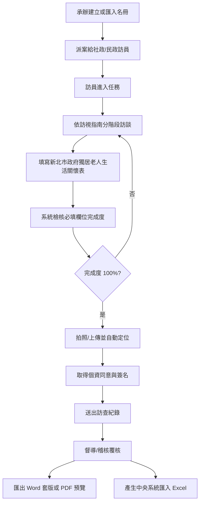

# 新北市政府獨居老人生活關懷表流程說明

## 測試資料

本系統已建立一筆模擬測試資料：

- 個案：吳秀枝
- 案號：NTPC-115-TEST-001
- 區里：新北市板橋區新民里
- 排程：schedule_ntpc_demo
- 測試頁：`/visitor/visits/schedule_ntpc_demo`

進入測試頁後，系統會自動帶入一份完整的新北關懷表模擬答案，可直接驗證完成度、送出與匯出入口。

## 操作流程

## 畫面說明

### 1. 進入訪員訪視頁

路徑：

`/visitor/visits/schedule_ntpc_demo`

頁面上方會看到：

- 長者姓名
- 案號
- 行政區與里別
- 第幾次訪視
- 離線草稿保存狀態

### 2. 填寫新北關懷表

訪員頁上方已加入「訪視指南」，依《獨居長者普查訪視指南》拆成以下操作段落：

- 訪視前行政確認
- 第一階段：居住、家庭與聯絡方式
- 第二階段：身體健康與飲食
- 第三階段：社交、困難與近期心情
- 第四階段：服務宣導與同意
- 現場觀察任務：不要直接問，請用眼睛看

每一段會提供建議開場、應填表單區段與現場檢核重點，讓訪員依現場對話順序填寫，而不是直接面對一長串欄位。

關懷表分成五個區塊：

1. 一、獨居老人基本資料
2. 二、居住與家庭支持
3. 三、身體狀況
4. 四、生活困難、情緒與活動
5. 五、訪查員觀察題

每個區塊使用百葉窗展開，右側會顯示該區必填欄位完成數。

### 3. 完成度檢核

系統會即時計算：

- 整份表單完成度百分比
- 必填欄位完成數
- 尚缺必填欄位

必填欄位未完成時，不能送出訪查紀錄，也不能產生 Word / PDF。

### 4. A3 套印與高關懷

表單完成度達 100% 後，可使用 **下載完整 A3 PDF（含題目）**。

- 空白母版：Google Spreadsheet `106h8JIuZ4CdCUqXn5vImoxRbveTknylzsiy4lMpAnPk`
- 工作表：`獨居長者生活關懷表`
- 產製方式：複製母版 → 依題目對照寫入答案儲存格 → `scale=4` 縮放至單頁
- 固定格式：**一頁、A3、直式**
- 檔名：`YYYY-MM-DD_個案姓名.pdf`
- 保存位置：Google Drive `關懷表 PDF` 目錄；同時下載到訪員裝置

對照見 [`ntpc-paper-vs-mohw-102.md`](./ntpc-paper-vs-mohw-102.md)。

橘／黃／綠由系統依紙本色塊規則計算，訪員不必手選。送出後若觸發，自動寫入 `高關懷名冊`。承辦至 `/manager/high-care` 篩選與更新狀態。

### 5. 後台 Excel 匯出

承辦或督導可到：

`/manager/exports`

選擇：

- `社會局中央系統匯入 Excel`

目前已建立欄位模板，正式欄位順序需依社會局提供的中央系統格式鎖定。

## 驗證清單

- [ ] 開啟 `/visitor/visits/schedule_ntpc_demo`
- [ ] 確認顯示 `新北市政府獨居老人生活關懷表`
- [ ] 確認完成度為 100%
- [ ] 展開各段表單，確認欄位已有模擬答案
- [ ] 點選 `下載完整 A3 PDF（含題目）`
- [ ] 確認 PDF 只有 1 頁，尺寸為 A3 直式
- [ ] 確認檔名為 `日期_個案姓名.pdf`，且 Google Drive `關懷表 PDF` 目錄已有同名檔
- [ ] 確認第三句色碼為系統計算、不可手選
- [ ] 送出訪查紀錄（有色塊則出現高關懷提示）
- [ ] 到 `/manager/high-care` 確認列管與統計
- [ ] 到 `/manager/exports` 確認衛福部 102 欄 xlsx 仍可用

## 目前限制

- 正式 A3 需由 GAS 產製，才能直接填入 Google 試算表母版並保存至 Drive。
- 正式下載 API 未設定 GAS 時會停止匯出，避免產生欄位可能錯位的 PDF；`public/forms/ntpc-life-care-google-sheet-a3.pdf` 僅供本機版面預覽。
- 中央系統 Excel 欄位順序依衛福部 102 欄範本。
