# 永和區獨居長者訪查管理平台 — 運作架構說明書

> **版本**：115 年度試運行版  
> **帳號**：GitHub `yongheelderly0826-design` · Google `yongheelderly0826@gmail.com`  
> **相關文件**：[`system-operation-manual.md`](./system-operation-manual.md)（操作手冊）

---

## 1. 架構總覽

本平台採 **GitHub + Google Apps Script + Google Sheets + Next.js（Vercel）** 四層架構。  
營運資料以 **Google 試算表為唯一主檔**；網站透過 **GAS Web App API** 讀寫試算表。

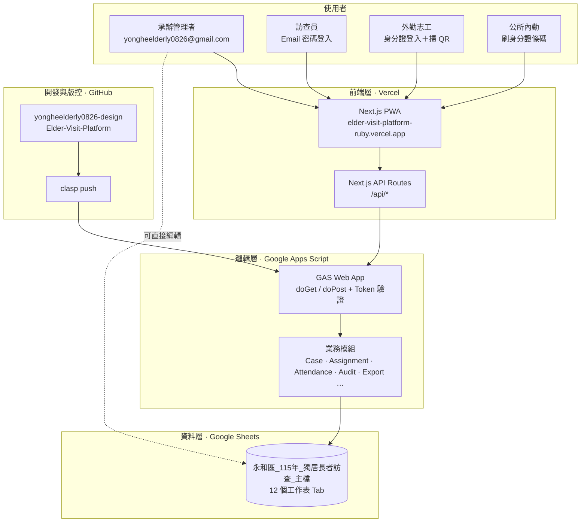

---

## 2. 正式環境部署拓撲

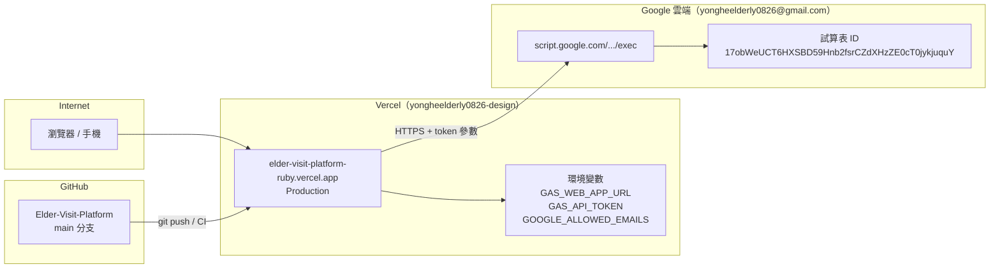

| 元件 | 網址／識別 |
|------|------------|
| 正式網站 | https://elder-visit-platform-ruby.vercel.app |
| 試算表主檔 | https://docs.google.com/spreadsheets/d/17obWeUCT6HXSBD59Hnb2fsrCZdXHzZE0cT0jykjuquY/edit |
| 程式倉庫 | https://github.com/yongheelderly0826-design/Elder-Visit-Platform |
| 工作區 ID | `WS-YH-115` |
| 去識別化前綴 | `YH-115` |

---

## 3. 四層職責分工

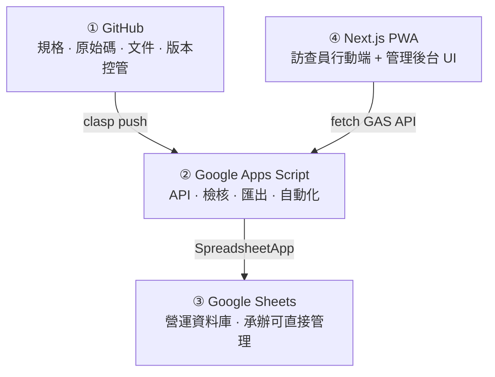

| 層級 | 工具 | 職責 | 目錄 |
|------|------|------|------|
| 版本與規格 | GitHub | PR、Issue、欄位定義、部署腳本 | `docs/`、`scripts/` |
| 業務邏輯 | GAS | REST API、衛福部 xlsx、編碼、觸發器 | `gas/src/` |
| 營運資料 | Google Sheets | 個案、派案、訪查、稽核、核銷 | 雲端試算表 12 Tab |
| 使用者介面 | Next.js | 登入、名冊、派案、訪查 PWA | `app/`、`lib/gas-client.ts` |

---

## 4. 請求資料流（讀寫個案）

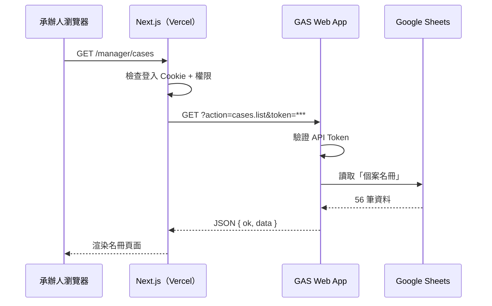

**Repository 模式**：Next.js 依環境變數決定資料來源。

| `dataMode` | 條件 | 資料來源 |
|------------|------|----------|
| `gas_ready` | 已設定 `GAS_WEB_APP_URL` + `GAS_API_TOKEN` | GAS → Sheets（**正式環境**） |
| `mock` | 未設定 GAS 變數 | 內建假資料（僅開發／誤設時） |
| `supabase_ready` | 已設定 Supabase（Phase 2） | PostgreSQL |

---

## 5. 業務流程架構

平台有兩條並行業務線：

### 5.1 獨居長者訪查

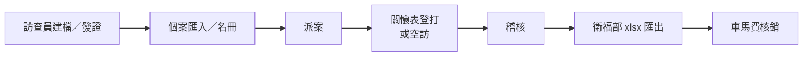

### 5.2 12 組志工出勤

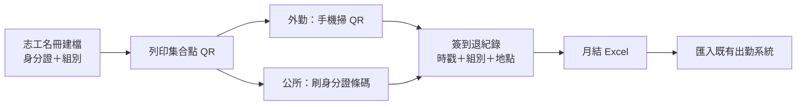

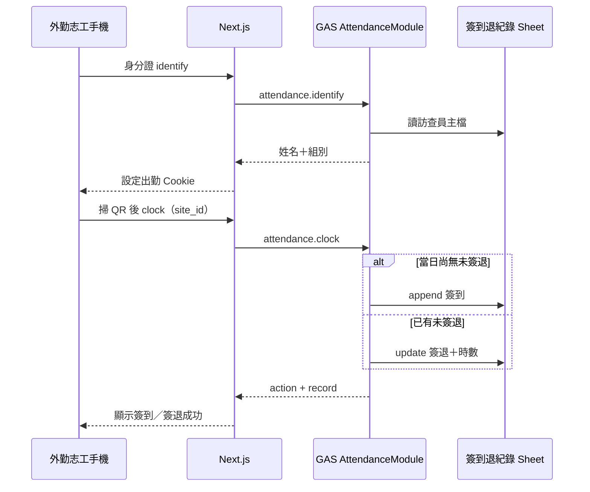

| 流程節點 | 試算表 Tab | GAS 模組 | 前端路徑 |
|----------|-----------|----------|----------|
| 訪查員／志工建檔 | `訪查員主檔`（含 `volunteer_group`） | `VisitorModule` | `/workspace/users`、`/manager/attendance` |
| 個案名冊 | `個案名冊` | `CaseModule` | `/manager/cases` |
| 派案 | `派案紀錄` | `AssignmentModule` | `/manager/assignments` |
| 志工出勤簽到退 | `簽到退紀錄` | `AttendanceModule` | `/volunteer/clock`、`/office/kiosk` |
| 關懷表 | `關懷表登打` | `CareFormModule` | `/visitor/visits/[id]` |
| 稽核 | `稽核佇列` | `AuditModule` | `/manager/audit` |
| 衛福部匯出 | `匯出紀錄` | `ExportModule` | `/manager/exports` |
| 出勤月結 | Drive「志工出勤月結」＋本機 xlsx | `AttendanceModule.monthlyExport` | `/manager/attendance` |
| KPI | `報表快照` | `ReportModule` | `/manager/kpi` |
| 車馬費 | `車馬費核銷` | `PaymentModule` | `/manager/pricing` |

---

## 6. Google 試算表結構

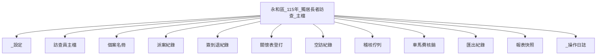

詳細欄位見 [`sheets/schema-overview.md`](./sheets/schema-overview.md)。

---

## 7. GAS 後端模組地圖

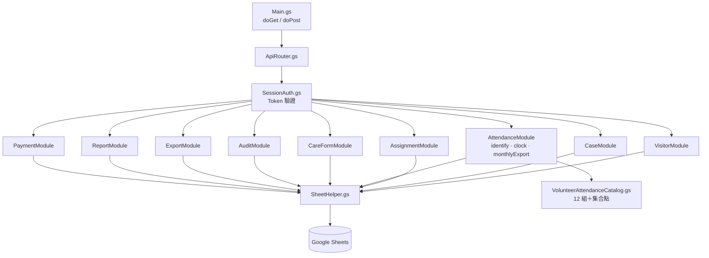

原始碼路徑：`gas/src/` · API 規格：[`architecture/gas-api.md`](./architecture/gas-api.md)

---

## 8. 登入與權限架構

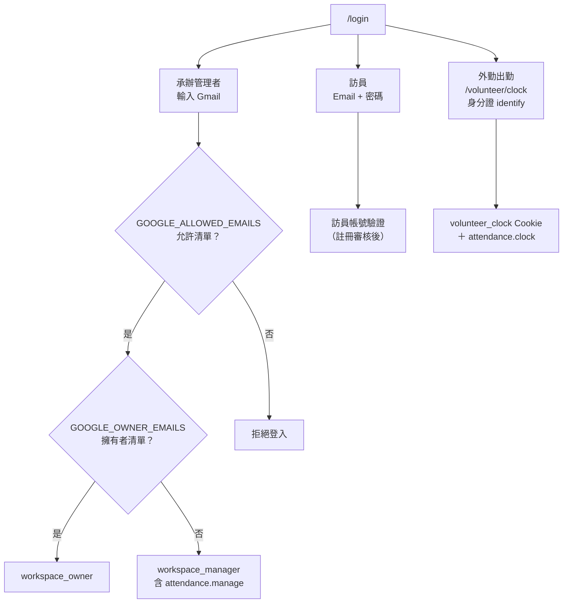

| 角色 | 權限範圍 |
|------|----------|
| `workspace_owner` | 全部功能（成員、權限、設定） |
| `workspace_manager` | 名冊、派案、匯入、稽核、匯出、志工出勤月結／刷證 |
| `supervisor` | 稽核覆核、出勤月結查閱 |
| `visitor` | 任務、關懷表、外勤掃 QR 簽到退（`attendance.clock`） |

---

## 9. 開發與部署流程

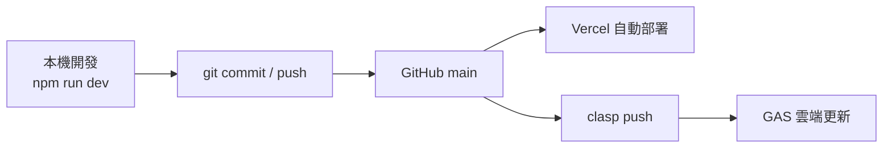

| 變更類型 | 部署方式 |
|----------|----------|
| 前端 UI / API Route | `git push` → Vercel Production |
| GAS 後端邏輯 | `clasp push` 或 `scripts/deploy-gas.sh` |
| 試算表欄位 | 手動或 `scripts/init-sheets.sh` / GAS `bootstrapPlatform()` |
| 環境變數 | Vercel Dashboard → Redeploy |

---

## 10. 安全架構要點

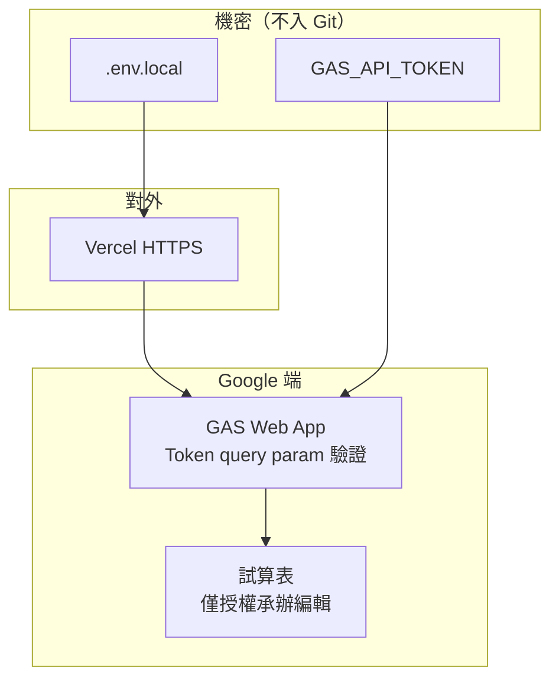

1. **GAS Token** 僅存於 Vercel 環境變數與本機 `.env.local`，不提交 GitHub。  
2. **個資最小化**：關懷表使用去識別化編碼（`YH-115-A001`）；出勤月結含身分證，僅承辦下載。  
3. **試算表共用** 僅授予必要 Gmail 編輯權限。  
4. **操作日誌** 由 GAS 自動寫入 `_操作日誌`，人工不可刪改。  
5. **公所刷證** 需承辦登入；外勤僅能對自己身分證 identify 後打卡。

---

## 11. Phase 2 選用路徑（Supabase）

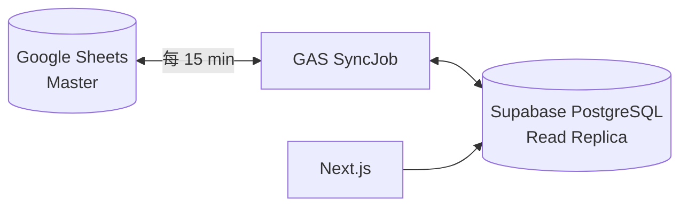

目前永和試運行以 **Sheets + GAS** 為主；Supabase 為未來高流量或複雜查詢之選用遷移路徑。

---

## 12. 相關文件索引

| 文件 | 說明 |
|------|------|
| [`system-operation-manual.md`](./system-operation-manual.md) | 日常操作手冊 |
| [`architecture/README.md`](./architecture/README.md) | 架構總覽（開發者版） |
| [`architecture/github-sheets-gas-stack.md`](./architecture/github-sheets-gas-stack.md) | 三層架構詳細設計 |
| [`architecture/data-flow.md`](./architecture/data-flow.md) | 資料流與同步策略 |
| [`architecture/deployment.md`](./architecture/deployment.md) | clasp / Vercel 部署 |
| [`architecture/gas-api.md`](./architecture/gas-api.md) | GAS API 規格 |
| [`sheets/schema-overview.md`](./sheets/schema-overview.md) | 試算表欄位定義 |

---

## 修訂紀錄

| 日期 | 版本 | 說明 |
|------|------|------|
| 2026-08-31 | 1.0 | 初版：四層架構、正式環境拓撲、資料流與業務流程圖 |
| 2026-09-03 | 1.1 | 新增 12 組志工出勤架構圖、AttendanceModule 與權限 |
