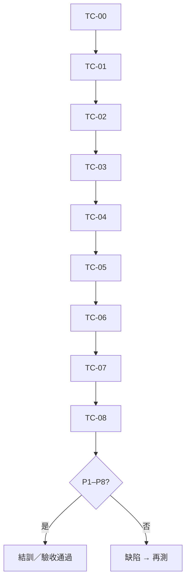

# 12 組志工出勤 — 驗收／訓練勾選表

> **用途**：教育訓練實作勾選、上線驗收、缺陷登錄。  
> **講師手冊（觀念＋課程節奏）**：請先讀 [`system-operation-manual.md`](./system-operation-manual.md) **§9**。  
> **環境**：Production `https://elder-visit-platform-ruby.vercel.app`  
> **資料主檔**：Google 試算表「訪查員主檔」「簽到退紀錄」  
> **更新日期**：2026-09-04  

其他管理員若要在自己電腦開啟：GitHub 私有倉庫邀請為 Collaborator 後，開啟本檔或操作說明書 §9（見操作說明 §9.1）。

---

## 0. 通過定義（結訓／驗收）

| # | 必過條件 | 通過 |
|---|----------|------|
| P1 | 外勤頁免登入可開啟 | ☐ |
| P2 | 承辦可建志工名冊（身分＋組別） | ☐ |
| P3 | 外勤身分證登入後可掃 QR 簽到 | ☐ |
| P4 | 同一天第二次操作可簽退，且有時數／紀錄 | ☐ |
| P5 | 公所刷證櫃台可簽到／簽退 | ☐ |
| P6 | 月結 Excel 可下載且欄位正確 | ☐ |
| P7 | 試算表「簽到退紀錄」有對應列 | ☐ |
| P8 | 訪查流程與出勤流程互不干擾（抽樣） | ☐ |

**標記**：`☐` 未測 · `☑` 通過 · `⚠` 有條件通過（註明） · `✗` 失敗

---

## 1. 測試前準備

### 1.1 帳號與裝置

| 角色 | 準備 |
|------|------|
| 承辦 | 可登入正式站之管理者帳號 |
| 外勤手機 | 有相機、可上網（建議無痕） |
| 公所電腦 | 瀏覽器＋條碼槍（鍵盤模式）或手動輸入 |

### 1.2 測試用志工（勿用於正式名冊）

| 代號 | 姓名 | 身分證 | 電話 | 組別 | 用途 |
|------|------|--------|------|------|------|
| T-MEAL | 測試送餐甲 | `A123456789` | `0912000001` | 送餐服務組 | 外勤 QR |
| T-OFF | 測試內勤乙 | `B234567894` | `0912000002` | 行政內勤組 | 公所刷證 |

### 1.3 入口網址

| 功能 | URL |
|------|-----|
| 登入 | https://elder-visit-platform-ruby.vercel.app/login |
| 志工出勤（承辦） | https://elder-visit-platform-ruby.vercel.app/manager/attendance |
| 外勤掃碼 | https://elder-visit-platform-ruby.vercel.app/volunteer/clock |
| 送餐組 QR 直連 | https://elder-visit-platform-ruby.vercel.app/volunteer/clock?site=SITE-MEAL |
| 公所刷證 | https://elder-visit-platform-ruby.vercel.app/office/kiosk |
| 系統狀態 | https://elder-visit-platform-ruby.vercel.app/system/status |

### 1.4 自動化腳本（技術選用）

在專案根目錄（需 `.env.local`）：

```bash
cd /path/to/Elder-Visit-Platform
node scripts/verify-volunteer-attendance-flow.mjs
```

通過時印出 `ok: true`。**不取代**下方 UI 勾選。

---

## 2. 案例清單（TC-00～TC-08）

### TC-00 環境煙霧

| 步驟 | 操作 | 預期結果 | 結果 |
|------|------|----------|------|
| 1 | 未登入開 `/volunteer/clock` | 勿導向登入；可見「掃 QR 簽到退」 | ☐ |
| 2 | 未登入開 `/manager/attendance` | 導向登入 | ☐ |
| 3 | 登入後 `/system/status` | `gas_ready` | ☐ |
| 4 | `/manager/attendance` | 名冊、QR、下載 Excel | ☐ |

### TC-01 承辦建檔

| 步驟 | 操作 | 預期結果 | 結果 |
|------|------|----------|------|
| 1 | 登入 → 出勤頁 | 進入頁面 | ☐ |
| 2 | 新增 T-MEAL | 名冊有「測試送餐甲／送餐服務組」 | ☐ |
| 3 | 新增 T-OFF | 名冊有「測試內勤乙」 | ☐ |
| 4 | 重複同一身分證 | 拒絕或提示已存在 | ☐ |
| 5 | 試算表訪查員主檔 | `volunteer_group` 為 `meal` / `office` | ☐ |

### TC-02 QR 海報

| 步驟 | 操作 | 預期結果 | 結果 |
|------|------|----------|------|
| 1 | 集合點 QR 海報 | 含 SITE-MEAL、SITE-KIOSK 等 | ☐ |
| 2 | 掃送餐組 QR | `/volunteer/clock?site=SITE-MEAL` | ☐ |
| 3 | 頁面地點 | 顯示名稱或 SITE-MEAL | ☐ |

### TC-03 外勤簽到

| 步驟 | 操作 | 預期結果 | 結果 |
|------|------|----------|------|
| 1 | 無痕開送餐 QR 頁 | 身分證輸入 | ☐ |
| 2 | 輸入 `X999999999` | 找不到志工 | ☐ |
| 3 | `A123456789` 登入 | 測試送餐甲／送餐服務組 | ☐ |
| 4 | 確認簽到 | 成功 | ☐ |
| 5 | 試算表簽到退 | `channel=qr`、`site_id=SITE-MEAL`、有簽到無簽退 | ☐ |

### TC-04 外勤簽退

| 步驟 | 操作 | 預期結果 | 結果 |
|------|------|----------|------|
| 1 | 再簽一次 | 簽退成功 | ☐ |
| 2 | 狀態 | 可再次簽到 | ☐ |
| 3 | 試算表 | 有 `checkout_at` | ☐ |
| 4 | 出勤頁本月列表 | 外勤QR＋簽退時間 | ☐ |

### TC-05 公所刷證

| 步驟 | 操作 | 預期結果 | 結果 |
|------|------|----------|------|
| 1 | 登入 → `/office/kiosk` | 大輸入框 | ☐ |
| 2 | 未登入開 kiosk | 導向登入 | ☐ |
| 3 | `B234567894` + Enter | 測試內勤乙簽到 | ☐ |
| 4 | 再刷一次 | 簽退 | ☐ |
| 5 | 試算表 | `barcode`／`office_kiosk`、`SITE-KIOSK` | ☐ |

### TC-06 月結 Excel

| 步驟 | 操作 | 預期結果 | 結果 |
|------|------|----------|------|
| 1 | 出勤頁下載 Excel | 檔案可開 | ☐ |
| 2 | 表頭 | 年月～出勤編號共 12 欄 | ☐ |
| 3 | 內容 | T-MEAL 與 T-OFF 各至少一筆完整簽到退 | ☐ |
| 4 | 身分證欄 | 完整測試號（勿外流） | ☐ |
| 5 | （選）Drive 鏡像 | `志工出勤_YYYY-MM.xlsx` | ☐ |

### TC-07 負向

| 步驟 | 操作 | 預期結果 | 結果 |
|------|------|----------|------|
| 1 | 無 site 簽到 | 提示需掃組別 QR | ☐ |
| 2 | 外勤登出再開 | 需重輸身分證 | ☐ |
| 3 | 停用志工再 identify | 拒絕 | ☐ |
| 4 | 兩人不同證 | 不串號 | ☐ |

### TC-08 與訪查隔離

| 步驟 | 操作 | 預期結果 | 結果 |
|------|------|----------|------|
| 1 | 名冊／派案 | 仍可操作 | ☐ |
| 2 | 訪員任務（若有） | 與出勤登入不互相覆蓋 | ☐ |
| 3 | `/manager/exports` | 可進（與出勤 Excel 分開） | ☐ |

---

## 3. 建議順序



---

## 4. 實測紀錄

| 欄位 | 內容 |
|------|------|
| 日期 | |
| 講師／測試人員 | |
| 學員 | |
| 環境 | Production |
| 實際身分證 | T-MEAL：　　　T-OFF： |
| 自動化腳本 | `ok: true`／未跑／失敗 |
| 結論 | 通過／有條件通過／不通過 |
| 缺陷摘要 | |

### 缺陷登錄

| ID | 案例 | 現象 | 嚴重度 | 狀態 |
|----|------|------|--------|------|
| | | | 高／中／低 | 未修／已修 |

---

## 5. 簽名

| 角色 | 姓名 | 日期 | 簽章 |
|------|------|------|------|
| 訓練執行／測試 | | | |
| 學員／承辦確認 | | | |
| 系統管理 | | | |

---

## 6. 相關文件

| 文件 | 說明 |
|------|------|
| [`system-operation-manual.md`](./system-operation-manual.md) §9 | 教育訓練手冊（主文） |
| [`system-operation-manual.md`](./system-operation-manual.md) §5.7 | 日常出勤操作 |
| `scripts/verify-volunteer-attendance-flow.mjs` | 自動驗收腳本 |

---

## 7. 自動化預檢（參考）

2026-09-04 正式 GAS（含 Drive xlsx 修復 v15）執行腳本結果：`ok: true`（外勤＋公所＋list＋`monthlyExport_drive`）。訓練仍以網站實作為準。
